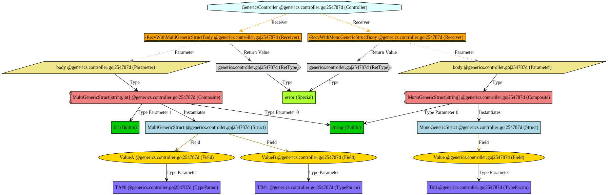

# Gleece Changelog

## Gleece v2.1.0

### Summary

*Gleece* 2.1 brings in concrete support for type aliases, map input/outputs and an overhauled type resolution system.

### Features

* Support for type aliasing.</br>
Previously, alias support was limited and resulted in the aliased type effectively wiping the alias itself.

  Both declared and assigned aliases are valid:

  ```go
	// A unique ID
  	type Id string  `validate:"regex=^[0-9A-Fa-f]{8}(?:-[0-9A-Fa-f]{4}){3}-[0-9A-Fa-f]{12}$"`

	// A unique ID
  	type Id = string `validate:"regex=^[0-9A-Fa-f]{8}(?:-[0-9A-Fa-f]{4}){3}-[0-9A-Fa-f]{12}$"`
  ```
  </br>
  These aliases will be translated into an equivalent OpenAPI model:

  ```yaml
  Id:
      type: "string"
      format: "^[0-9A-Fa-f]{8}(?:-[0-9A-Fa-f]{4}){3}-[0-9A-Fa-f]{12}$"
      description: "A unique ID"
  ```
</br>

* Full support for `map`.</br>
	Previously, non-primitive maps like `map[string]something.Something` would not resolve correctly, resulting errors.


* Infrastructure-level support for generics</br>
	Generics support represent *Gleece*'s next major milestone.

	This change includes the necessary infrastructure.
	These include expansion of the HIR to encode the one-to-many relationships between composites (e.g. `Something[string, bool, int]`) and their instantiated dependencies (e.g. `string`, `bool` and `int`)

	Below you can see a graphical dump of a controller with generics in use:

	


* Added an configuration option to disable failure after encountering issues during package loads.

	To use this option, create a `failOnAnyPackageLoadError` (`boolean`) field under the `commonConfig` section of your `Gleece Config` file, e.g.:

	```json
	{
		"commonConfig": {
			"failOnAnyPackageLoadError": false,
			"controllerGlobs": [
				"./*.go",
				"./**/*.go"
			]
		},
		...
		...
		...
	}
	```

	For some complex environments, specifically those using generated code, there sometimes is a need to ignore package load errors.

	A typical use case is when the project has controllers and generated code in the same directory hierarchy with no discernable naming patterns.

	*Gleece* may attempt to load the yet-to-be-generated code and fail.

	This configuration option is an 'escape hatch' for these cases.

### Enhancements

* Overhauled type resolution flows.
  
  *Gleece* now has a set of composable visitors, each tailored for a specific part of the AST.

* Added a global `ApiValidator` as the entry point to the HIR validation subsystem.</br>
  This currently includes a URL conflict detection algorithm to emit diagnostics upon route conflicts such as between `POST /a/b/c` and `POST /a/{foo}/c`


------------------

## Gleece v2.0.0

### Summary

*Gleece* 2 is a major milestone that includes a complete overhaul of the internal code analysis and validation facilities
as well as a multitude of small bug fixes.

These changes aim drastically improve performance and allow us to better expand and maintain the project and provide the groundwork for powerful and unique features down the road like live OAS preview, LSP support and more.

For more information, please see the [architecture](https://docs.gleece.dev/docs/about/architecture) section of our documentation.

### Features

* Added a rich, LSP oriented diagnostics system. Issues will be reporter with far greater detail and clarity

* Added many validation previously available only via the IDE extension

* Added facilities necessary to generate full project dependency graphs (`SymbolGraph.ToDot`)

* Created a `GleecePipeline` to orchestrate execution and lifecycle.
	  This allows re-using caches and previous analysis results to expedite subsequent operations.

* Added support for `byte` and `time.Time` fields in returned structs

### Enhancements

* Improved analysis speed by up to 50% via code optimization and introduction of package, file and node caches

* Adjusted most processes to yield sorted results for more consistent builds results

* Reduced import clutter in generated route files

* Re-structured the project to provide a much clearer separation of concerns and allow for easier maintenance

* Improved test coverage

### Bugfixes 
* Fixed several cases of panic due to mis-configuration or invalid commands

* Fixed cases where documentation was not properly siphoned from some types of entities

* Fixed several issues with complex, nested type layers (*e.g*.map[string][][]int) resolution

* Fixed several issues with complex type resolution

* Fixed several issues with import detection resulting in resolution failures

* Fixed an issue that could cause type information to be emitted with incorrect `PkgPath`

* Fix custom error causing OpenAPI 3.1 generation to fail
